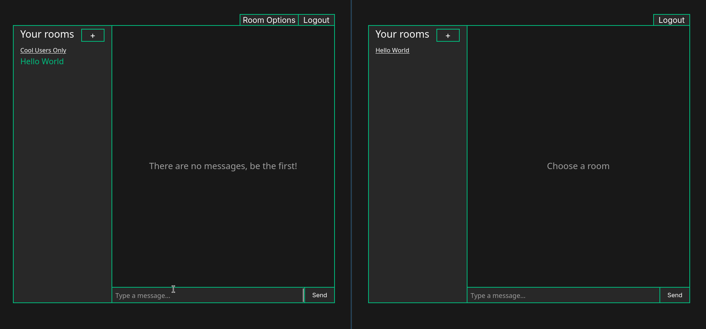
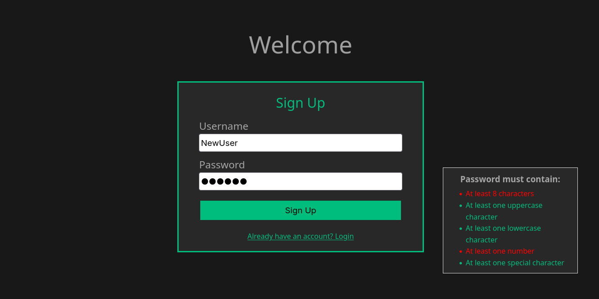
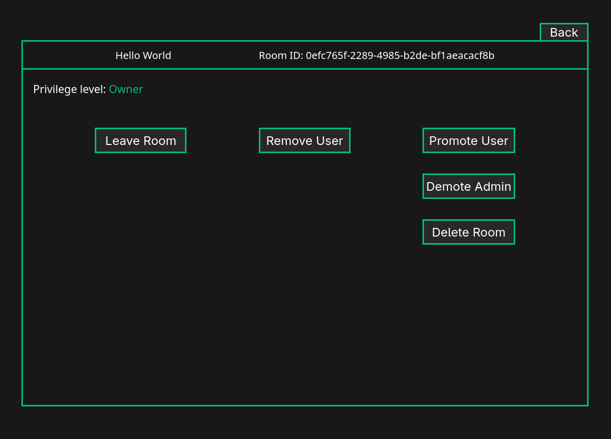

# Chat Room

A real-time, multi-room chat app. Users sign up, create rooms, invite others, and talk live over WebSockets with owner/admin roles controlling who can manage each room. The whole stack starts with one command.



Built with a **C++ backend**, a **Vue.js frontend**, and **ScyllaDB**, behind an **Nginx** reverse proxy that terminates TLS. Originally a project for Oregon State's CS 406, since reworked to run reproducibly with Docker Compose.

## Features

- Sign up / log in with **JWT** authentication and **bcrypt**-hashed passwords
- Create rooms and join as many as you like; each user sees their own rooms
- **Live messaging** over WebSockets, with no refresh needed
- **Chat history** from a REST API
- **Role-based permissions:** owners can promote and demote admins, admins can manage members but cannot demote the owner
- **HTTPS throughout:** TLS from the browser to Nginx, and again from Nginx to the backend

## Screenshots

| Sign up | Room management |
| --- | --- |
|  |  |

## Architecture

```
                 ┌───────────────────────────────┐
 Browser ──────► │ Nginx (443, TLS)              │
                 │  /      → Vue static files    │
                 │  /rest/ → backend :8080       │
                 │  /ws/   → backend :8081       │
                 └──────────────┬────────────────┘
                                │
                      ┌─────────▼─────────┐        ┌───────────┐
                      │ C++ backend       │ ─────► │ ScyllaDB  │
                      │ REST + WebSocket  │        │ (CQL)     │
                      └───────────────────┘        └───────────┘
```

| Service | What it does |
| --- | --- |
| `web` | Nginx serving the built Vue app, proxying `/rest/` and `/ws/` to the backend |
| `backend` | One C++ process, two TLS servers on separate threads: a REST API (cpp-httplib, port 8080) and a WebSocket server (uWebSockets, port 8081) |
| `scylla` | ScyllaDB database, data kept in the `scylla-data` volume |
| `schema` | One-shot job that applies `backend/database/chat_schema.cql` once Scylla is healthy |

## Quick start

Requires Docker with the Compose plugin and OpenSSL.

```bash
git clone https://github.com/colby-noah/chat-room.git
cd chat-room

# 1. Self-signed TLS certificate (for local use)
./scripts/gen-certs.sh

# 2. Secret used to sign JWTs
echo "JWT_SECRET=$(openssl rand -base64 32)" > .env

# 3. Build and start everything
docker compose up -d --build
```

Then open **https://localhost**. Your browser will warn about the self-signed certificate; accept it to continue. The first start takes a minute or two while ScyllaDB boots and the schema is applied.

```bash
docker compose logs -f backend   # follow backend logs
docker compose down              # stop (database data is kept)
docker compose down -v           # stop and wipe the database
```

After rebuilding the backend, run `docker compose restart web` so Nginx re-resolves it.

## Configuration

| Variable | Where | Purpose |
| --- | --- | --- |
| `JWT_SECRET` | `.env` | Signing key for auth tokens. Compose refuses to start without it. |
| `REST_PORT`, `WEBSOCKET_PORT` | `docker-compose.yml` | Backend ports (8080 / 8081) |
| `DATABASE_IP` | `docker-compose.yml` | Hostname of the ScyllaDB node |
| `SSL_CERT_PATH`, `SSL_KEY_PATH` | `docker-compose.yml` | Certificate paths used by the backend |

Secrets, keys, and certificates are gitignored. `backend/env.example.sh` documents the variables for running the backend outside Docker.

## Design notes

- **REST for writes, WebSockets for delivery.** Messages are sent with a normal authenticated `POST`; the server stores them and broadcasts to everyone connected to that room. A client opens a WebSocket and sends its JWT and a room ID. The server checks the token and room membership before subscribing it, so a user can't listen in on rooms they don't belong to.
- **Same-origin API.** The frontend calls `/rest` and `/ws` on whatever host serves it, and Nginx routes them. There are no hard-coded backend URLs in the production build and no CORS to configure.
- **Schema as code.** Keyspace and tables live in `backend/database/chat_schema.cql` and are applied automatically by the `schema` service, so a fresh clone gets a working database.
- **Reproducible builds.** Backend dependencies (libbcrypt, the ScyllaDB C++ driver, and vcpkg packages) are built inside a multi-stage Dockerfile, so nothing needs installing on the host.

## Challenges

- **WebSockets returned 502 behind Nginx.** The error was `SSL_do_handshake() failed ... wrong version number`. The cause was that uSockets installed through vcpkg was built without TLS support, so the backend spoke plain TCP while Nginx expected TLS. Requesting the `usockets[ssl]` feature fixed it.
- **A compiler default broke the build.** Newer g++ defaults to C++20, which broke a `std::string`/JSON comparison. Pinning `-std=c++17` in the Makefile resolved it.
- **Containerizing a C++ stack from scratch.** Getting all the native libraries to build in a clean image was the biggest piece of work.

## Known issues

- Messages are rendered as HTML and not yet sanitized, so this is **not production-safe** as is.
- ScyllaDB runs as a single node with `SimpleStrategy` for local use. A real deployment would use multiple nodes and `NetworkTopologyStrategy`. Earlier versions of the project used three nodes, but it has been cut down to one for simplicity.
- The certificate is self-signed, so browsers show a warning.

## Project layout

```
backend/     C++ server, Dockerfile, Makefile, CQL schema
frontend/    Vue app and Dockerfile
deploy/      Nginx configuration
scripts/     Helper scripts (certificate generation)
docs/        Design documents and images
```
